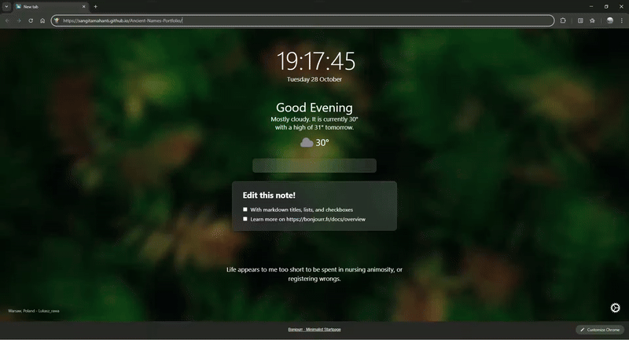

# 🏛️ Bronze Age Lore System: Full-Stack Data Modeling Application (WIP)

## Project Status: Frontend Implemented with React + Vite (Phase 1 Complete)

This repository hosts the **live, component-based frontend** for a planned full-stack Content Management System (CMS). The application is built using the modern **React JS** framework with the **Vite** build tool, demonstrating a focus on performance, component architecture, and modern front-end tooling.

The current frontend utilizes a dataset **validated against actual archaeological or historical findings**, providing a foundation of high-integrity data.
## 📸 Preview




---

## 💡 Project Vision: Full-Stack Developer Roadmap

The goal is to deploy a secure, full-stack CMS that showcases advanced **Data Modeling Specialist** skills by handling the ambiguities and complex relationships inherent in historical data.

### Key Features of the Full-Stack MERN Roadmap

| Feature | Description | Technical Skill Focus |
| :--- | :--- | :--- |
| **Data Modeling Focus** | Model and track complex, inferred relationships between entities across distinct regions (e.g., Character $\leftrightarrow$ Location $\leftrightarrow$ Artifact). | **MongoDB Schema Design, Mongoose** |
| **Secure Authentication** | Implement **JWT (JSON Web Token) authentication** for a secure Admin Dashboard, enabling authorized **CRUD** operations on the lore database. | **Node.js/Express Middleware, Security Best Practices** |
| **Data Integrity Pipeline** | Backend validation scripts designed to manage data sourced from fields like *undeciphered* or *inferred* data. | **Validation, Node.js Scripting** |
| **Dynamic Frontend** | Advanced filtering and search to allow users to query entities based on metadata, region, and cultural interaction status. | **React State Management, API Consumption** |

---

## 🛠️ Current Technology Stack (Phase 1)

* **Frontend Framework:** **React JS**
* **Build Tool:** **Vite** (for fast development and performance)
* **Target Backend:** **Node.js, Express.js, MongoDB (MERN Stack)**
* **Languages:** JavaScript (ES6+), HTML5, CSS3

## 🚀 Running Locally

```bash
# 1. Clone the Repository
git clone [https://github.com/sangitamahanti/Ancient-Names-Portfolio.git](https://github.com/sangitamahanti/Ancient-Names-Portfolio.git)]
# 2. Install Dependencies
cd Ancient-Names-Portfolio
npm install 
# 3. Start the Development Server
npm run dev

🌐 Live Demonstration
Live Demo:(https://sangitamahanti.github.io/Ancient-Names-Portfolio/)

Developed by: Sangita Mahanti
